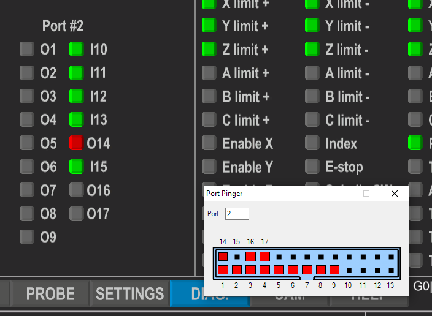

# UCCNCPortPingerPlugin

This is a plugin for UCCNC Motion Control Software that allows you send signals to port output pins.

## WARNING:

The author holds no responsibility for any damage, injury or harm caused by use or misuse of this software product.
This software may or may not have been tested. Use it at your own risk.
Software is shipped AS-IS



## Installation

Grab the latest copy of the PortPinger.dll here:
[Releases](https://github.com/swindex/UCCNCPortPingerPlugin/releases/)
... drop it into ```C:\UCCNC\Plugins``` directory and enable it/check for startup in UCCNC Plugin config

## License
MIT

## Autor
Eldar Gerfanov

## Contributing

Pull requests are welcome!
